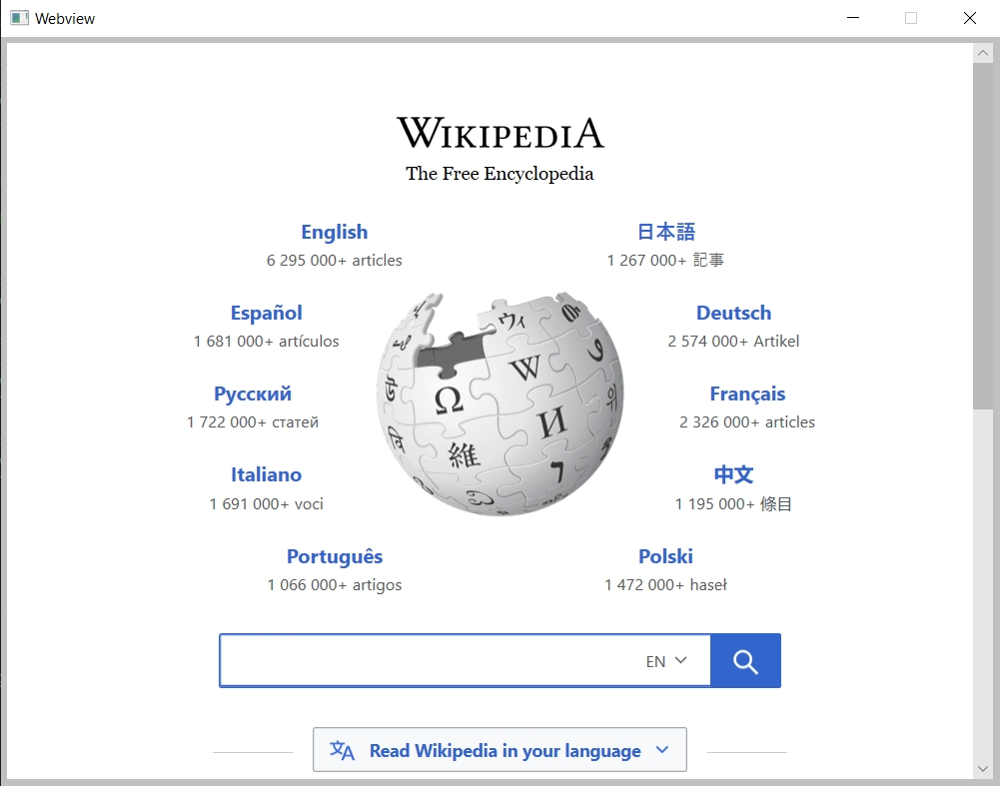

# fltk-webview

This provides webview functionality for embedded fltk windows. This currently works on Windows:

## Usage

```rust
use fltk::{prelude::*, *};

fn main() {
    let app = app::App::default();
    let mut win = window::Window::default()
        .with_size(800, 600)
        .with_label("Webview");
    let mut wv_win = window::Window::default()
        .with_size(790, 590)
        .center_of_parent();
    win.end();
    win.show();
    
    let mut wv = fltk_webview::Webview::from(false, &mut wv_win);
    wv.navigate("http://google.com");

    app.run().unwrap();
}
```

## Limitations
- On windows, webview requires winrt headers, that means it's basically buildable with the MSVC toolchain. For Msys2/mingw, there are efforts to provide such headers, but nothing yet upstream.
<<<<<<< HEAD
- On MacOS, unhandled exceptions arising from the objective-c code can cause application crashes.
- On linux, I can't construct a GtkWindow from an FLTK window nor from an FLTK raw handle (XID). If you're able to do so, you're help is needed!
=======
- On macos, unhandled objective-c exceptions can lead to application crashes.
- On linux, I can't construct a GtkWindow from an FLTK window nor from an FLTK raw handle (xid). If you're able to do so, your help is needed!
>>>>>>> ed7ab6e6e2339f75bd79e89ee4f42452c282ec88


